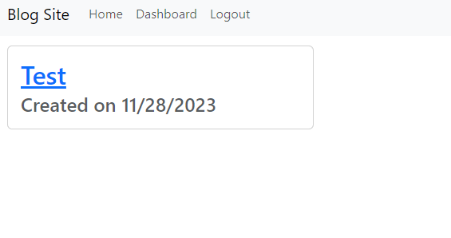

# CMS Blog Site

#### by JJ Saoit 

## Description

Blog site where you can just blog about anything you want

## Preview

## Table of Contents

- [Installation](#installation)
- [Usage](#usage)
- [Credits](#credits)
- [License](#license)

## Installation

run the server.js with node

## Usage

Blogging site that uses an sql dtabase

## Credits

Name: JJ Saoit
E-mail: saoitjensen@gmail.com
Github: jensenjamessaoit
Colaborators: N/A

## License

This project is licensed under [MIT](https://opensource.org/license/mit/).
